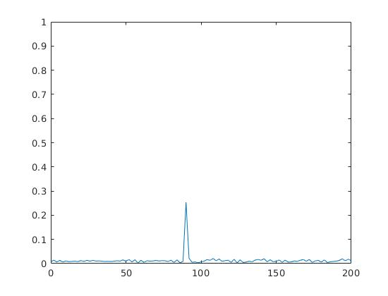
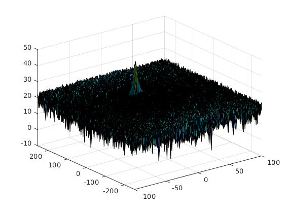
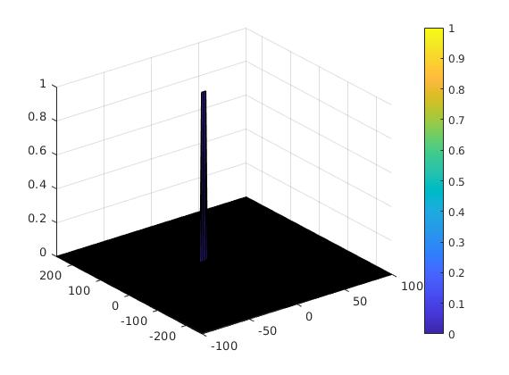

## Project

### Visualization

### 2D CFAR
1. Implementation steps for the 2D CFAR process
- loop over all bins (range and doppler)
- slice the range doppler map to create the training cells
- and convert them to power
- calculate mean noise level of the training cells
- revert cells back to decibel
- add an offset to keep the false alarm to the minimum
- finally apply threshold

2. Selection of Training, Guard cells and offset
- the parameters are defined starting from line 146-157
- I chose them by trial and error
- choosing the right offset was essential for a sufficient result

3. Steps taken to suppress the non-thresholded cells at the edges
- see line 187
- I just setted every cell to zero
- and only add a value to the CFAR result if the threshold is exceeded
